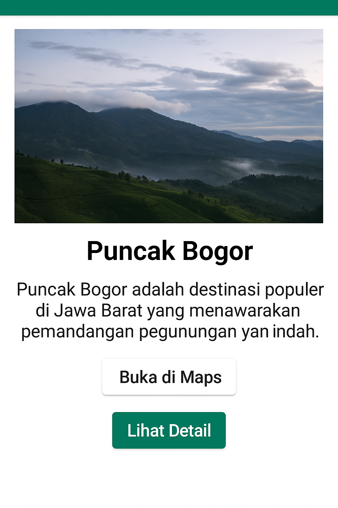

# InfoWisataBogor

UTS Pemrograman Mobile ITBS-JM

Aplikasi Android sederhana yang menampilkan informasi tentang tempat wisata di Bogor, termasuk foto, deskripsi, dan tombol buka Maps.

## Fitur:
- Tampilan gambar wisata
- Deskripsi singkat
- Tombol buka Google Maps
- Halaman detail informasi

## Teknologi:
- Java
- Android XML Layout

## Screenshot:

## Developer:
Nama Rama Ramdhani 
Kelas: ITBS-JM
